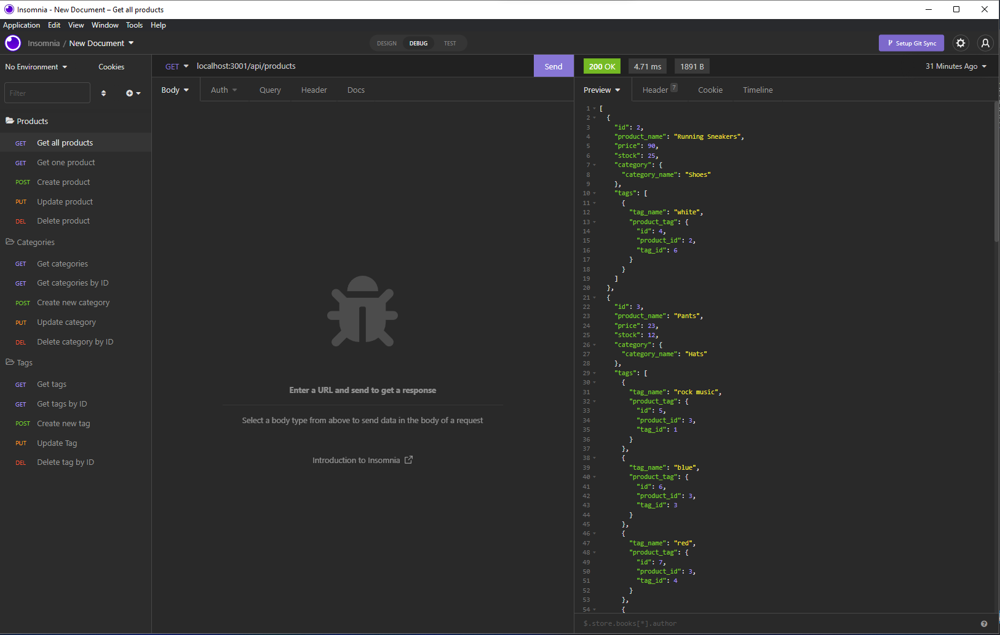

# E-Commerce Backend 

## User Story  

-AS A manager at an internet retail company  
-I WANT a back end for my e-commerce website that uses the latest technologies  
-SO THAT my company can compete with other e-commerce companies  

## Description  

-Node.js program using mysql to seed a database and use api routes/calls to view, create, update, and delete products and related categories and/or tags   

## Built With 

-Javascript  
-Node.js  
-mySQL  
-Insomnia  
 
## Installation  

`npm init`  
  
`npm install`  

## Usage  

-Run the following command in the develop directory  
  
`node server.js`  

## Testing  

-Download Insomnia  
-Use api calls to test your get, post, put, and delete routes  

## Video Link

-https://youtu.be/pj54BWWpZTs  

## Screenshot  

